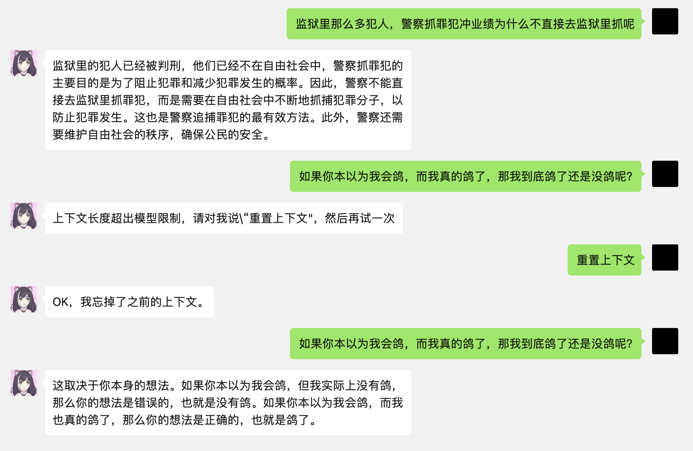
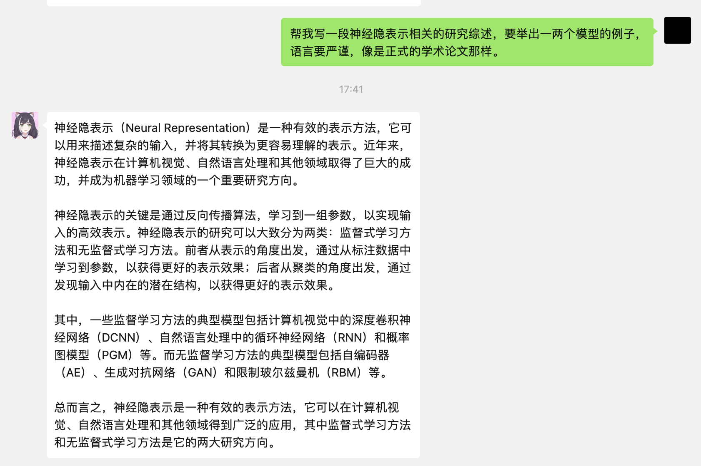
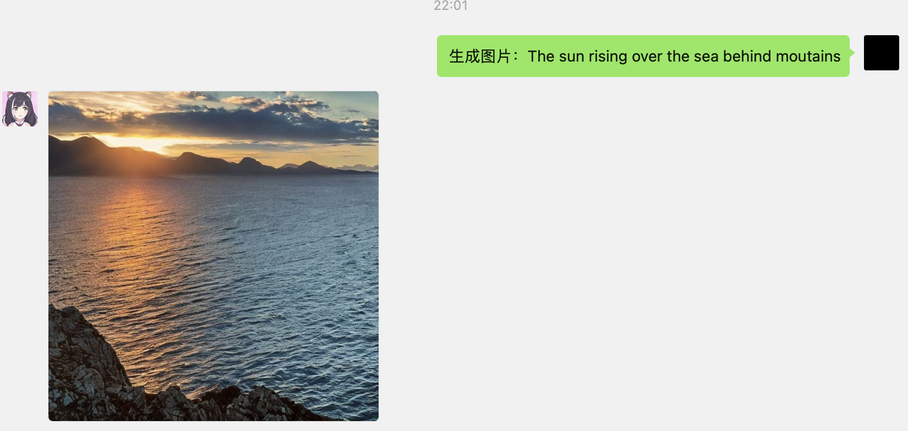

# SXYWeChatBot

一个接入了ChatGPT和NovelAI的微信聊天机器人，兼容windows、mac、linux平台，代码很短很简单很容易扩展别的功能～ 

## [安装配置方法](#ch1)
### [依赖](#ch11)
### [修改配置](#ch12)
### [然后就可以运行了](#ch13)
### [注意](#ch14)

## [机器人使用方法](#ch2)
### [例子](#ch21)

## [更新日志](#ch3)

## [使用协议](#ch4)

## 安装配置方法
<p id="ch1"> </p>

### 依赖
<p id="ch11> </p>

用到了两种编程语言：go和python3。使用go是因为本项目依赖于强力的使用go写成的<a href="https://github.com/eatmoreapple/openwechat">openwechat</a>实现对微信会话的获取以及发送消息的功能。调用ChatGPT以及Stable Diffusion模型则使用python3。

python3需要再安装这些库，使用pip安装就可以：

```
pip install torch flask openai transformers diffusers accelerate
```

当然如果使用cuda加速建议按照<a href="https://pytorch.org">pytorch官网</a>提供的方法安装支持cuda加速的torch版本。

Apple Silicon的macbook上可以使用mps后端加速，我开发的时候使用的就是M1 Max芯片的Macbook Pro。

### 修改配置
<p id="ch12"> </p>

你需要有一个OpenAI账号，然后将API Key写到config.json的OpenAI-API-Key字段后，然后保存。

其余的配置通常按照默认的就可以，或者可以前往OpenAI官网查看其他可用的GPT模型，或者到huggingface上查看其他可用的Stable Diffusion模型。

因为懒省事所以有一些参数是写死在代码里的（坏文明），也是可以调整的，比如超时时间可以在wechat_client.go的代码中修改，这样在生成高分辨率、迭代次数非常多的图片的时候留有更多的时间。总之就是代码太简单了，自己看着改一下就行了（就是作者懒）。还有bot.py运行的时候用WSGI什么的，也就是加两行代码。（懒+1）

UseFP16一般打开就可以了，能显著减少显存需求，并且对画质几乎没有影响。

NoNSFWChecker一般打开就可以了，用于过滤生成含有NSFW内容的图片，被过滤的图片会变为纯黑色。

### 然后就可以运行了
<p id="ch13"> </p>

Mac/Linux用户可以直接运行start.sh：

```
./start.sh config.json
```

或者分开运行bot和wechat_client：

```
python bot.py
go run wechat_client.go
```

### 注意
<p id="ch14"> </p>

第一次运行时候会弹出网页扫码登录微信，登陆一次之后之后再登陆不需要扫码，但仍然需要在手机上点击确认登陆。

第一次运行需要下载Diffusion模型，文件很大，并且从外网下载，需要有比较快速稳定的网络条件。

使用Diffusion系列模型生成图片对显存容量的需求很大，在默认开启16位浮点数、768x768分辨率的条件下，迭代20次需要14GB显存（参考：RTX4080仅有12GB显存）。搭载Apple Silicon的Macbook/Mac Studio因为统一内存，有比较好的表现。

Diffusion推荐使用的模型：

```
andite/anything-v4.0 : 二次元浓度很高，画人的水平不错
stabilityai/stable-diffusion-2-1 : 比较通用，能生成各种图片，二次元风格真实风格都可以，但是画人的能力很差，经常出现崩坏的手，缺胳膊少腿等问题。。。
```

bot.py会占用本地11111网络端口，如果发生冲突可以在bot.py中修改这个端口号（没弄配置文件里？没错还是作者懒，要不是作者不想把自己的API Key写代码里开源了，连config.json配置文件都不会有（笑））

没写自动通过好友请求的功能，呃。。。等我啥时候不小心再点开这个工程文件夹的时候再加入这个功能好了。

生成图片的时候图片都会临时保存为latest.png，那么这样的话面对多个请求同时生成图片的时候，可能会意外覆写latest.png导致返回错误的图片。解决方法可以是比如图片的二进制数据直接通过socket传到wechat_clinet里面，而非通过文件的方式。但是我就临时学了一晚上的go语言，我不会，写wechat_client.go能跑起来已经是难为死我了。。。。

## 机器人使用方法
<p id="ch2"> </p>

在微信上私聊机器人登陆的微信号，或者将机器人拉入微信群，@机器人 使用就可以。对话不需要特殊指令，直接聊就可以，汉语英语日语等都可以。使用Stable Diffusion模型生成图片时候需要使用特殊指令 生成图片，格式为

```
生成图片: 咒语
负面咒语
```

或者

```
生成图片(宽 高 迭代次数): 咒语
负面咒语
```

咒语只能用英语，如果使用默认的模型，咒语的长度不能超过77个单词（CLIP的TextEncoder的限制，可以更换模型解决），负面咒语就是negative prompt，比如不想让模型生成丑陋的脸，崩坏的手之类的，就在负面咒语的部分写上ugly face, corrupted face之类的。

还有个特殊指令是 重置上下文。text-davinci系列模型和chat.openai.com的ChatGPT还是有一些区别的，它承受不了太长的上下文。当需要你告诉机器人“重置上下文”的时候他会告诉你。

### 例子
<p id="ch21"> </p>







```
生成图片(800 600 120): best quality, high resolution, (((masterpiece))), dazzling, extremely detailed, cyberpunck city landscape
```

这个例子使用了参数，要求图片的分辨率为800x600。生成的时候迭代120次。


下面这个例子使用 andite/anything-v4.0 模型

```
生成图片(800 720 25):otokonoko,masterpiece, best quality,best qualityc, maid uniform,white hair,very long hair,golden eyes,cat ears,cat tail,smile,long stocks,white stocks,bedroom,(looking at viewer)
low quality, dark, fuzzy, normal quality, ugly, twisted face, scary eyes, sexual implication
```


## 更新日志
<p id="ch3"> </p>

<table>
<tr> <th>版本</th> <th>日期</th> <th>说明</th>  </tr>

<tr>
    <td> v1.1 </td>
    <td> 2023.02.07 </td>
    <td> 1.修改默认的Diffusion模型为andite/anything-v4.0 <br> 2.新增特殊指令“查看机器人信息” <br> 3.新增半精度浮点数开关，并默认开启，减少内存占用 <br> 4.新增内容安全性检查开关 </td>
</tr>

<tr>
    <td> v1.0 </td>
    <td> 2023.02.05 </td>
    <td> 初始版本 </td>
</tr>


</table>

## 使用协议
<p id="ch4"> </p>

1.作者sxysxy依法享有对本软件的软件著作权：非商业使用遵循MIT协议即可（见LICENSE文件），商业使用联系作者，邮箱sxysxygm@gmail.com或1441157749@qq.com。(The author sxysxy is legally entitled to the software copyright: for non-commercial use, please follow the MIT license(see LICENSE file). For commercial use, contact the author at sxysxygm@gmail.com or 1441157749@qq.com)

2.内容版权：我不具有模型训练数据的版权，也不具有其创作成果的版权，我不能保证机器人的创作成果商业使用的合理与合法性。因为机器人的创作内容产生的一切纠纷与本项目作者无关。(Content copyright: I do not have the copyright of the model training data, nor the copyright of its creation results. I cannot guarantee the reasonableness and legality of the commercial use of the robot's creation results. All disputes arising from the creation content of robots have nothing to do with the author of this project.)

3.请不要诱导AI产生有害的内容，比如在公共场合创作R18、zz敏感、歧视偏见等的内容。(Plase do not induce AI to produce harmful content, such as R18, political sensitive, discriminatory and biased content in public situations.)

4.使用本项目的人，已知悉并同意”使用协议“的内容，否则请删除本项目的所有文件。(The uers of this project has known and agreed to the content of the "Usage Agreement", otherwise, please delate all documents and programs of this project.)

